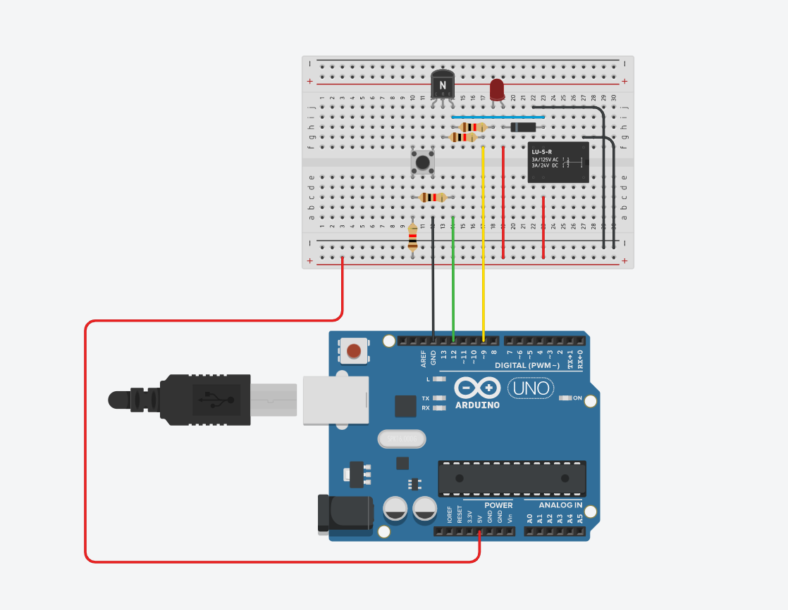

# ON-OFF-Push-Button

## Basics
A Relay is a large mechanical switch, which is toggled on or off by energizing a coil.

Depending on the operating principle and structural features relays are of different types, such as:

Electromagnetic Relays
Solid State Relays
Thermal Relays
Power Varied Relays
Reed Relays
Hybrid Relays
Multi-dimensional Relays and so on, with varied ratings, sizes and applications.

## Why to use a relay with an Arduino?
○ A micro controller's GPIO (general purpose input/output) pins cannot handle higher power devices 
○ A relay basically allows a relatively low voltage to easily control higher power circuits 

## Hardware Requirement
○ 1 x Breadboard 
○ 1 x Arduino Nano/UNO  
○ 1 x Relay 
○ 1 x 1K resistor 
○ 1 x 1N4007 High Voltage, High Current Rated Diode to protect the micro-controller from voltage spikes 
○ 1 x 2N2222 General purpose NPN transistor 
○ 1 x LED and a 220 ohm current limiting resistor to test the connectivity 
○ Few connecting cables 
○ A USB cable to upload the code to the Arduino and general soldering equipment. 

## circuit
 
 

