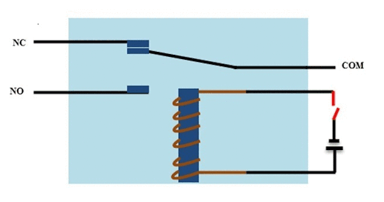
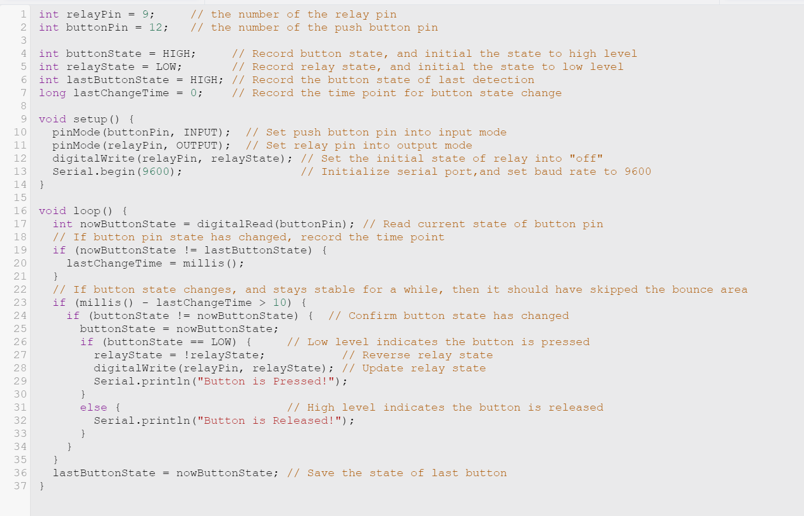

# ON-OFF-Push-Button

## Basics💡
**• A relay is a programmable electrical switch , which can be controlled by Arduino or any micro-controller.It is used to programmatically control on/off the devices which use the high voltage and/or high current**  
**• It is a bridge between Arduino and high voltage devices** 

## Why to use a relay with an Arduino❓ 
○ A micro controller's GPIO (general purpose input/output) pins cannot handle higher power devices 
○ A relay basically allows a relatively low voltage to easily control higher power circuits 

## How a Relay Works🛠️❓ 
The following animation shows a simplified working of a relay  
 

 
 

## Push buttons 
**•Push buttons are the basic on-off switching buttons most commonly used in less to highly complex electronic devices** 
**•The push-button has four legs but we can use only two of them because of their internal structure** 

### What we want to achieve is simple: 
When we press push button,It will turn the LED ON and when we press push button again it will turn the LED OFF💡 

## Hardware Requirement⚙️
**○ 1 x Breadboard** 
**○ 1 x Arduino Nano/UNO** 
**○ 1 x Relay** 
**○ 1 x 1K resistor** 
**○ 1 x 1N4007 High Voltage, High Current Rated Diode to protect the micro-controller from voltage spikes** 
**○ 1 x 2N2222 General purpose NPN transistor** 
**○ 1 x LED and a 220 ohm current limiting resistor to test the connectivity** 
**○ Few connecting cables** 
**○ A USB cable to upload the code to the Arduino and general soldering equipment** 

## Connection diagram🔍
 
 
## The Code📝
 

## To simulate ⬇️
○ https://www.tinkercad.com/things/bBUjpHrvaaV

